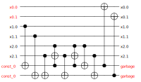
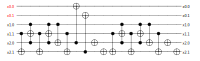

# Description and Features

_MQT SyReC Synthesizer_ {cite:p}`adarsh2022syrecSynthesizer` allows users to automatically synthesize reversible circuits from a high-level HDL description.
The proposed tool accepts any HDL description following the SyReC grammar and syntax as described in detail in {cite:p}`wille2016syrec` (example circuits are available in the test/circuits directory).
The tool provides an easy-to-use GUI with which the user can specify any preferred functionality.
As an example, consider the SyReC program for a simple 2-bit Adder as shown in the figure below.

  

This Adder computes the sum of the inputs x1 and x2 and stores the result in the output signal x0.
By clicking on the  button, the tool automatically synthesizes the corresponding circuit.
To this end, two complementary synthesis schemes are available:

1. _Cost-aware synthesis_:
   In this synthesis scheme, additional circuit lines (representing circuit signals) are introduced to store the corresponding intermediate results of each operation—thereby providing the liberty to accordingly modify the circuit without having any effect on the original inputs (for more details, refer {cite:p}`wille2010syrec` and {cite:p}`wille2016syrec`).
   This results in a circuit description where the gate costs are kept moderate at the expense of a substantially larger number of additionally needed circuit lines. The following figure depicts the circuit which results when synthesizing the program from above.

   

     
   

2. _Line-aware synthesis_:
   This synthesis scheme aims to the keep the number of additional circuit lines as small as possible. To achieve this, the corresponding intermediate results of each operation are computed and stored using one of the available circuit lines (rather than additional circuit lines).
   Afterwards, the inputs are re-computed with the help of the corresponding inverse operations (for more details, refer {cite:p}`wille2019towardsHDLsynthesis`). The figure below depicts the circuit which results when synthesizing the program from above using the line-aware scheme.

   

     
   

Furthermore, the tool allows to simulate the resulting circuit (by clicking on the  button) as well as to determine its gate costs (by clicking on the  button).
